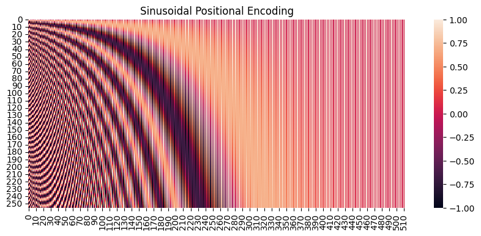
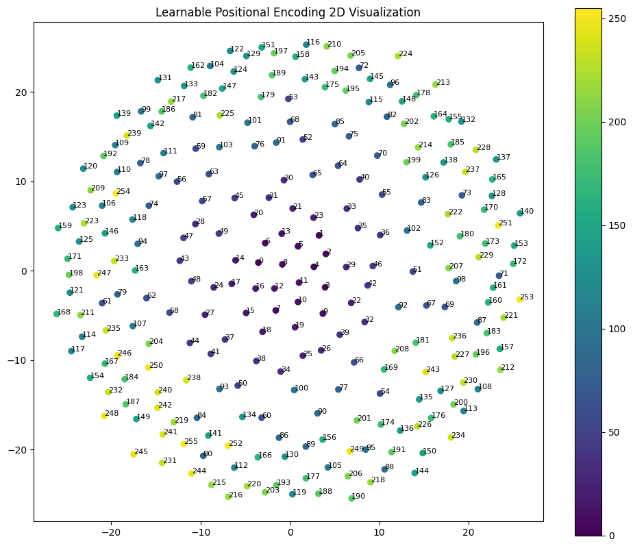
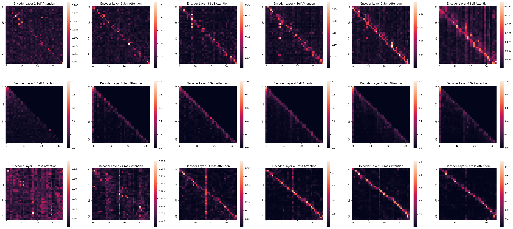

# C05 Report: Research on Positional Encoding in Transformer

The whole report is organized as follows:
- Why Positional Encoding
- Where to Add Positional Encoding
- Forms of Positional Encoding
- Different Positional Encoding
  - Sinusoidal Positional Encoding
  - Learnable Positional Encoding
  - Rotary Positional Encoding(RoPE)
  - Other Positional Encoding
- Experiment
  - Train, Inference and Test Commands
  - Train & Evaluation Results
  - Translate Example Results
  - Analysis of different Positional Encoding
- Supplementary: The implementation of Transformer

## Why Positional Encoding

- Transformer does not have any recurrence or convolution.
- Transformer's Linear or FFN only functions on each token independently.
- Transformer's MHA treats each token equally, that is, it has permutation invariance.


## Where to Add Positional Encoding

- Add Positional Encoding to the input embeddings. (Original Transformer, BERT, GPT etc.)
- Add Positional Encoding to the QKV embeddings in the MHA.(RoFormer, LLaMA, etc.)

## Forms of Positional Encoding

|           Forms           |                    Examples                   |
|:----------------------------:|:---------------------------------------------:|
| Learnable |            BERT, Roberta, GPT, GPT2           |
|          Sinusoidal          |          Transformer, Transformer XL          |
|             RoPE             | RoFormer, GPT-Neo, LLaMA, ChatGLM, Baichuan7B |
|             ALiBi            |        BLOOM, BloombergGPT, Baichuan13B       |
| ... | ... |

## Different Positional Encoding

### Sinusoidal Positional Encoding

Sinusoidal Positional Encoding is a fixed positional encoding functions after the word embedding, which is proposed by [Attention is All You Need](https://arxiv.org/abs/1706.03762). It is also a fixed positional encoding, which is not learnable. It has some good properties which enable it to perform well on sequences with arbitrary lengths and have some extrapolation ability.

#### Mathematical Expression

The formula of Sinusoidal Positional Encoding is as follows:

$$
\begin{aligned}
PE(t,2i)&=sin(t*w_{2i}) \\
PE(t,2i+1)&=cos(t*w_{2i}) \\
w_{2i}&=\frac1{N^{\frac{2i}d}}\\
N&=10000
\end{aligned}
$$

where $t$ is the position in the sequence, $i$ is the dimension of the embedding, and $d$ is the dimension of the embedding. The Sinusoidal Positional Encoding is a fixed positional encoding, which is not learnable. It has some good properties which enable it to perform well on sequences with arbitrary lengths and have some generalization ability (good extrapolation ability).

#### Visualization

Here is the visualization of Sinusoidal Positional Encoding(the horizontal axis is the word embedding dimension, and the vertical axis is the position in the sequence):


#### Implementation

`models/positional_encodings.py`
```python
class SinusoidalPositionalEncoding(nn.Module):
    def __init__(self, d_model, max_len=256):
        super(SinusoidalPositionalEncoding, self).__init__()

        pe = torch.zeros(max_len, d_model)
        position = torch.arange(0, max_len).unsqueeze(1).float()
        div_term = torch.exp(torch.arange(0, d_model, 2).float() * (-torch.log(torch.tensor(10000.0)) / d_model))

        pe[:, 0::2] = torch.sin(position * div_term)
        pe[:, 1::2] = torch.cos(position * div_term)

        pe = pe.unsqueeze(0)
        self.register_buffer('pe', pe)

    def forward(self, x):
        # input x: [batch_size, seq_len, d_model]
        self.pe = self.pe.to(x.device)
        # pe: [1, max_len, d_model]
        x = x + self.pe[:, :x.size(1)]
        # output x: [batch_size, seq_len, d_model]
        return x
```

#### Analysis

The Sinusoidal Positional Encoding is a fixed positional encoding, which is not learnable. But it have some good properties which enable it to perform well on sequences with arbitrary lengths and have some generalization ability (good extrapolation ability):

- the $PE(t + \Delta{t}, 2i)$ and $PE(t + \Delta{t}, 2i+1)$ can be linearly calculated by the $PE(t, 2i)$ and $PE(t, 2i+1)$, which we can expect that the model can learn the linear relationship between the positional embeddings of different positions.

$$
\begin{aligned}
PE(t+\Delta{t},2i)& =\quad PE(t+\Delta{t},2i) \\
&=\quad sin(t*w_{2i}+\Delta{t}*w_{2i}) \\
&=\quad sin(t*w_{2i})cos(\Delta{t}*w_{2i})+cos(t*w_{2i})sin(\Delta{t}*w_{2i}) \\
&=\quad PE(t,2i)PE(\Delta{t},2i+1)+PE(t,2i+1)PE(\Delta{t},2i) \\
PE(t+\Delta{t},2i+1)& =\quad PE(t+\Delta{t},2i+1)  \\
&=\quad cos(t*w_{2i}+\Delta{t}*w_{2i}) \\
&=\quad cos(t*w_{2i})cos(\Delta{t}*w_{2i})-sin(t*w_{2i})sin(\Delta{t}*w_{2i}) \\
&=\quad PE(t,2i+1)PE(\Delta{t},2i+1)-PE(t,2i)PE(\Delta{t},2i)  \\
\end{aligned}
$$

- The dot product of two position codes can reflect the distance between the two position codes (calculate on each adjacent sin and cos pair):

$$
\begin{aligned}
PE(t)PE(t+\Delta{t}) &= \sum_{i=0}^{i=d/2-1}sin(t*w_{2i})sin((t+\Delta{t})*w_{2i})+\sum_{i=0}^{i=d/2-1}cos(t*w_{2i})cos((t+\Delta{t})*u  \\
&= \sum_{i=0}^{i=d/2-1}sin(t*w_{2i})sin((t+\Delta{t})*w_{2i})+cos(t*w_{2i})cos((t+\Delta{t})*w_{2i})  \\
&= \sum_{i=0}^{i=d/2-1}cos((t-(t+\Delta{t}))*w_{2i})  \\
&= \sum_{i=0}^{i=d/2-1}cos(\Delta{t}*w_{2i})
\end{aligned}
$$

- Symmetry - the positional encoding is symmetric:

$$
PE(t + \Delta{t}) \cdot PE(t) = PE(t) \cdot PE(t + \Delta{t})
$$

- The product value decreases with the increase of the distance between the two positions:


But as tested by us and the authors of [Attention is All You Need](https://arxiv.org/abs/1706.03762), the Sinusoidal Positional Encoding has similar performance to Learnable Positional Encoding, and it is not the best choice for all tasks.

And [TENER](https://arxiv.org/abs/1911.04474) pointed out that in the real Transformer model, positional encoding has to be further multiplied by $W_q$, $W_k$ in the self-attention mechanism: $P(t)^TW_Q^TP(t+\Delta{t})W_K$, which will make the positional encoding lose its original properties:


Now there is only a few models that use Sinusoidal Positional Encoding besides the original Transformer, like [Transformer XL](https://arxiv.org/abs/1901.02860), [Reformer](https://arxiv.org/abs/2001.04451), etc.

### Learnable Positional Encoding

#### Mathematical Expression

Learnable Positional Encoding is a trainable parameter, which is a matrix of size $n \times d$ where $n$ is the max sequence length and $d$ is the embedding dimension. Here we can simply use a embedding layer to implement it.

#### Visualization

Here is the visualization of Learnable Positional Encoding which is from our trained model (also, the horizontal axis is the word embedding dimension, and the vertical axis is the position in the sequence):


We also use MDS algorithm to visualize the positional encoding on the 2D plane: 



We can intuitively see that the close positions have 'closer' positional encoding, which indicates that the model can learn the relationship on different positions.

Here is also a image from web which shows the positional encoding of BERT, which shows that the adequately learned learnable positional encoding has a more beautiful pattern:


#### Implementation

`models/positional_encodings.py`
```python
class LearnablePositionalEncoding(nn.Module):
    def __init__(self, d_model, max_positional_embedding=512):
        super(LearnablePositionalEncoding, self).__init__()

        self.learnable_pos = nn.Embedding(max_positional_embedding, d_model)
        pos_ids = torch.arange(max_positional_embedding).unsqueeze(0)
        self.register_buffer('pos_ids', pos_ids)

    def forward(self, x):
        pos = self.learnable_pos(self.pos_ids[:, :x.size(1)])
        x = x + pos
        return x
```

#### Analysis

It's easy to assume that Learnable Positional Encoding has no generalization ability (no extrapolation ability), because its max length has been set in advance, and it has no ability to handle sequences longer than the max length as there is method to infer the positional embedding for unseen positions, different from Sinusoidal Positional Encoding.

But it is commonly used in practice, like BERT, GPT, GPT2, etc. 

### Rotary Positional Encoding(RoPE)

RoPE stand for Rotary Positional Encoding, which is proposed by [RoPE: Randomized Positional Encoding](https://arxiv.org/abs/2104.09864). RoPE encodes the absolute position with a rotation matrix and meanwhile incorporates the explicit relative position dependency in self-attention formulation. Notably, RoPE enables valuable properties, including the flexibility of sequence length, decaying inter-token dependency with increasing relative distances, and the capability of equipping the linear self-attention with relative position encoding.

RoPE functions after the Q-K projection in the MHA module, which is different from the Sinusoidal Positional Encoding and Learnable Positional Encoding.

#### Mathematical Expression

The rotary positional encoding of position $t$ is defined as a rotation matrix $R^d_{\Theta, t}$:

$$
\boldsymbol{R}_{\Theta,t}^d=\begin{pmatrix}\cos t\theta_1&-\sin t\theta_1&0&0&\cdots&0&0\\\sin t\theta_1&\cos t\theta_1&0&0&\cdots&0&0\\0&0&\cos t\theta_2&-\sin t\theta_2&\cdots&0&0\\0&0&\sin t\theta_2&\cos t\theta_2&\cdots&0&0\\\vdots&\vdots&\vdots&\vdots&\ddots&\vdots&\vdots\\0&0&0&0&\cdots&\cos t\theta_{d/2}&-\sin t\theta_{d/2}\\0&0&0&0&\cdots&\sin t\theta_{d/2}&\cos t\theta_{d/2}\end{pmatrix}
$$

where $\theta_j=10000^{-2(j-1)/d},j\in[1,2,\ldots,d/2]$, $d$ stands for the dimension of the embedding, and $t$ is the position in the sequence.

Then the RoPE of $x$ ($x$ can be $q_t$ or $k_t$) is defined as:

$$
\text{RoPE}^d(x, t)=R_{\Theta,t}^d x
$$

It can also be written as:

$$\boldsymbol{R}_{\Theta,t}^d\boldsymbol{x}=\begin{pmatrix}x_1\\x_2\\x_3\\x_4\\\vdots\\x_{d-1}\\x_d\end{pmatrix}\otimes\begin{pmatrix}\cos t\theta_1\\\cos t\theta_1\\\cos t\theta_2\\\cos t\theta_2\\\vdots\\\cos t\theta_{d/2}\\\cos t\theta_{d/2}\end{pmatrix}+\begin{pmatrix}-x_2\\x_1\\-x_4\\x_3\\\vdots\\-x_{d-1}\\x_d\end{pmatrix}\otimes\begin{pmatrix}\sin t\theta_1\\\sin t\theta_1\\\sin t\theta_2\\\sin t\theta_2\\\vdots\\\sin t\theta_{d/2}\\\sin t\theta_{d/2}\end{pmatrix}$$

Just very similar to the Sinusoidal Positional Encoding, so that's why we called RoPE a relative positional encoding with a absolute positional encoding form.

RoPE can be regarded as a rotation operation in each adjacent embedding dimension, which can also be seen as a rotation operation in the complex domain.


#### Implementation

`models/positional_encodings.py`

We can implement RoPE in two ways:

The first way is to implement RoPE in the complex domain as we can interpret rotation as the multiplication of complex numbers, which is more efficient: (refering to [Meta LLaMA](https://github.com/meta-llama/llama.git))

```python
# 生成旋转矩阵
def precompute_freqs_cis(dim: int, seq_len: int, theta: float = 10000.0):
    """
    Precompute the frequency tensor for complex exponentials (cis) with given dimensions.

    This function calculates a frequency tensor with complex exponentials using the given dimension 'dim'
    and the end index 'end'. The 'theta' parameter scales the frequencies.
    The returned tensor contains complex values in complex64 data type.

    Args:
        dim (int): Dimension of the frequency tensor.
        end (int): End index for precomputing frequencies.
        theta (float, optional): Scaling factor for frequency computation. Defaults to 10000.0.

    Returns:
        torch.Tensor: Precomputed frequency tensor with complex exponentials.
    """
    # 计算词向量元素两两分组之后，每组元素对应的旋转角度\theta_i
    freqs = 1.0 / (theta ** (torch.arange(0, dim, 2)[: (dim // 2)].float() / dim))
    # 生成 token 序列索引 t = [0, 1,..., seq_len-1]
    t = torch.arange(seq_len, device=freqs.device)
    # freqs.shape = [seq_len, dim // 2] 
    freqs = torch.outer(t, freqs).float()  # 计算m * \theta

    # 计算结果是个复数向量
    # 假设 freqs = [x, y]
    # 则 freqs_cis = [cos(x) + sin(x)i, cos(y) + sin(y)i]
    freqs_cis = torch.polar(torch.ones_like(freqs), freqs) 
    return freqs_cis

# 旋转位置编码计算
def apply_rotary_emb(
    xq: torch.Tensor,
    xk: torch.Tensor,
    freqs_cis: torch.Tensor
) -> tuple[torch.Tensor, torch.Tensor]:
    """
    Apply rotary embeddings to input tensors using the given frequency tensor.

    This function applies rotary embeddings to the given query 'xq' and key 'xk' tensors using the provided
    frequency tensor 'freqs_cis'. The input tensors are reshaped as complex numbers, and the frequency tensor
    is reshaped for broadcasting compatibility. The resulting tensors contain rotary embeddings and are
    returned as real tensors.

    Args:
        xq (torch.Tensor): Query tensor to apply rotary embeddings.
        xk (torch.Tensor): Key tensor to apply rotary embeddings.
        freqs_cis (torch.Tensor): Precomputed frequency tensor for complex exponentials.

    Returns:
        Tuple[torch.Tensor, torch.Tensor]: Tuple of modified query tensor and key tensor with rotary embeddings.
    """
    # xq.shape = [batch_size, seq_len, dim]
    # xq_.shape = [batch_size, seq_len, dim // 2, 2]
    xq_ = xq.float().reshape(*xq.shape[:-1], -1, 2)
    xk_ = xk.float().reshape(*xk.shape[:-1], -1, 2)
    
    # 转为复数域
    xq_ = torch.view_as_complex(xq_)
    xk_ = torch.view_as_complex(xk_)
    
    # 应用旋转操作，然后将结果转回实数域
    # xq_out.shape = [batch_size, seq_len, dim]
    xq_out = torch.view_as_real(xq_ * freqs_cis[: xq.shape[1]]).flatten(2)
    xk_out = torch.view_as_real(xk_ * freqs_cis[: xk.shape[1]]).flatten(2)
    return xq_out.type_as(xq), xk_out.type_as(xk)
```

Another way is to implement RoPE in the real domain just as the formula we put forward before, which is more intuitive:

```python
def sin_position_encoding(batch_size, max_len, output_dim):
    '''
    :return: [batch_size, max_len, d_model]
    '''
    pe = torch.zeros(max_len, output_dim)  # [max_len, d_model]
    position = torch.arange(0, max_len, dtype=torch.float).unsqueeze(1)  # [max_len, 1]
    div_term = torch.exp(torch.arange(0, output_dim, 2).float() * (-math.log(10000.0) / output_dim))  # [d_model/2]
    pe[:, 0::2] = torch.sin(position * div_term)  # [max_len, d_model/2]
    pe[:, 1::2] = torch.cos(position * div_term)
    pe = pe.unsqueeze(1)
    pe = pe.transpose(0, 1)
    return pe


def RoPE(q, k, rope_pe):
    # q,k: (bs, head, max_len, output_dim)
    batch_size_q = q.shape[0]
    max_len_q = q.shape[1]

    batch_size_k = k.shape[0]
    max_len_k = k.shape[1]

    # (bs, head, max_len, output_dim)
    '''
    pos_emb = sinusoidal_position_embedding(batch_size, nums_head, max_len, output_dim, q.device)
    '''
    # (bs, max_len_q/k, output_dim_q/k)
    pos_emb_q = rope_pe[:, :max_len_q, :]
    pos_emb_k = rope_pe[:, :max_len_k, :]

    # cos_pos,sin_pos: (bs, head, max_len, output_dim)
    # 看rope公式可知，相邻cos，sin之间是相同的，所以复制一遍。如(1,2,3)变成(1,1,2,2,3,3)
    cos_pos_q = pos_emb_q[...,  1::2].repeat_interleave(2, dim=-1)  # 将奇数列信息抽取出来也就是cos 拿出来并复制
    sin_pos_q = pos_emb_q[..., ::2].repeat_interleave(2, dim=-1)  # 将偶数列信息抽取出来也就是sin 拿出来并复制

    cos_pos_k = pos_emb_k[...,  1::2].repeat_interleave(2, dim=-1)  # 将奇数列信息抽取出来也就是cos 拿出来并复制
    sin_pos_k = pos_emb_k[..., ::2].repeat_interleave(2, dim=-1)  # 将偶数列信息抽取出来也就是sin 拿出来并复制

    # q,k: (bs, head, max_len, output_dim)
    q2 = torch.stack([-q[..., 1::2], q[..., ::2]], dim=-1)
    q2 = q2.reshape(q.shape)  # reshape后就是正负交替了

    # 更新qw, *对应位置相乘
    q = q * cos_pos_q + q2 * sin_pos_q
    
    k2 = torch.stack([-k[..., 1::2], k[..., ::2]], dim=-1)
    k2 = k2.reshape(k.shape)
    # 更新kw, *对应位置相乘
    k = k * cos_pos_k + k2 * sin_pos_k

    return q, k
```

Then, we can modify the `q, k` in the MHA module:

```python
...
q,k = apply_rotary_emb(q_, k_, freqs_cis=freqs_cis)
...
```

#### Analysis

RoPE is a relative positional encoding with a absolute positional encoding form, which can be regarded as a rotation operation in each adjacent embedding dimension, which can also be seen as a rotation operation in the complex domain.

The motivation of RoPE is based on the properties of Euler's formula, as shown below, which can be expressed in the form of difference after multiplication, so relative position encoding could be possible:

$$
\begin{aligned}e^{im}*\overline{e^{in}}&=\quad(cos(m)+isin(m))*(cos(n)-isin(n))\\&=\quad cos(m)cos(n)+sin(m)sin(n)+i(sin(m)cos(n)-cos(m)sin(n)))\\&=\quad cos(m-n)+isin(m-n)\\&=\quad e^{i(m-n)}\end{aligned}
$$

That's to say, for example, when we only consider the first 2 adjacent dimension of $x$ at position $t$, we have:

$$
\begin{aligned}&q_t=\begin{pmatrix}q_t^{(1)}\\q_t^{(2)}\end{pmatrix}=W_qx_t=\begin{pmatrix}W_q^{(11)}&W_q^{(12)}\\W_q^{(21)}&W_q^{(22)}\end{pmatrix}\begin{pmatrix}x_t^{(1)}\\x_t^{(2)}\end{pmatrix}\\&q_t=[q_t^{(1)},q_t^{(2)}]=[q_t^{(1)}+iq_t^{(2)}]\end{aligned}
$$

where $x_t$ is the embedding at position $t$, $W_q$ is the projection matrix, and $q_t$ is the query projection of $x_t$. We can regard 2D $q_t$ as a complex number.

Then we define q-k projection with RoPE as:

$$\begin{aligned}
f_{q}(x_t,t)& =(W_q x_t)e^{it\theta}  \\
&= q_te^{it\theta}  \\
&= (q_t^{(1)}+iq_t^{(2)})(cos(t\theta)+isin(t\theta))  \\
&=(q_t^{(1)}cos(t\theta)-q_t^{(2)}sin(t\theta))+i(q_t^{(1)}sin(t\theta)+q_t^{(2)}cos(t\theta))  \\
&=[q_t^{(1)}cos(t\theta)-q_t^{(2)}sin(t\theta),q_t^{(1)}sin(t\theta)+q_t^{(2)}cos(t\theta)] \\
&=\begin{pmatrix}cos(t\theta)&-sin(t\theta)\\sin(t\theta)&cos(t\theta)\end{pmatrix}\begin{pmatrix}q_t^{(1)}\\q_t^{(2)}\end{pmatrix}
\end{aligned}$$

$f_{k}(x_t,t)$ can be calculated in the same way.

We can tell that it just means we rotate the 2D $q_t$ by $\theta$ in the complex domain.

It can be further proved that the inner product of two query embeddings at different position ($m$ and $n$) after applying position coding is only related to the relative position $(m-n)$:

$$f_q(x_m,m)=[q_m^{(1)}cos(m\theta)-q_m^{(2)}sin(m\theta),q_m^{(1)}sin(m\theta)+q_m^{(2)}cos(m\theta)]\\f_k(x_n,n)=[k_n^{(1)}cos(n\theta)-k_n^{(2)}sin(n\theta),k_n^{(1)}sin(n\theta)+k_n^{(2)}cos(n\theta)]$$

$$\begin{aligned}
<f_q(x_m,m),f_k(x_n,n)> &=(q_{m}^{(1)}cos(m\theta)-q_{m}^{(2)}sin(m\theta))(k_{n}^{(1)}cos(n\theta)-k_{n}^{(2)}sin(n\theta))\\
&\quad+(q_{m}^{(1)}sin(m\theta)+q_{m}^{(2)}cos(m\theta))(k_{n}^{(1)}sin(n\theta)+k_{n}^{(2)}cos(n\theta))\\
&=q_m^{(1)}\cos(m\theta)k_n^{(1)}\cos(n\theta)-q_m^{(1)}\cos(m\theta)k_n^{(2)}\sin(n\theta) \\
&\quad-q_m^{(2)}\sin(m\theta)k_n^{(1)}\cos(n\theta)+q_m^{(2)}\sin(m\theta)k_n^{(2)}\sin(n\theta) \\
&\quad+q_m^{(2)}\cos(m\theta)k_n^{(2)}\cos(n\theta)+q_m^{(2)}\cos(m\theta)k_n^{(1)}\sin(n\theta) \\
&\quad+q_m^{(1)}\sin(m\theta)k_n^{(2)}\cos(n\theta)+q_m^{(1)}\sin(m\theta)k_n^{(1)}\sin(n\theta) \\
&=(q_m^{(1)}k_n^{(1)}+q_m^{(2)}k_n^{(2)})\cos((m-n)\theta)+(q_m^{(1)}k_n^{(2)}-q_m^{(2)}k_n^{(1)})\sin((m-n)\theta) \\
&=(q_m^{(1)}k_n^{(1)}+q_m^{(2)}k_n^{(2)})\cos((m-n)\theta)-(q_m^{(2)}k_n^{(1)}-q_m^{(1)}k_n^{(2)})\sin((m-n)\theta)
\end{aligned}$$

As long as the embedding dimensions are grouped in pairs and the $\theta$ of each group is different, it can be generalized to d-dimensional scenarios. That's exactly the formula we wrote before.

The RoPR also descends with the increase of the relative distance between the two positions:


So we can infer that the same two different tokens with same relative distance at different absolute position will produce the same attention. Also the further the distance, the less the attention. And the product form of the RoPE is insistent with the product form of MHA. These are very good properties for the RoPR.

And Rope is widely used in the latest models, like GPT-Neo, LLaMA, etc.

### Other Positional Encoding

There are also some other positional encoding methods, like:
- ALiBi: Adaptive Linearized Bi-directional Positional Encoding, which is proposed by [Train Short, Test Long: Attention with Linear Biases Enables Input Length Extrapolation](https://arxiv.org/abs/2108.12409). It functions on the Q-K inner product and before the softmax operation in the MHA module. ALiBi adds a linear bias term to the Q-K inner product regarding the relative position and distance, which can enable the model to extrapolate to longer sequences.
- Relative: Relative Positional Encoding. There are tons of variants of relative positional encoding, but all of them are based on the relative position between two tokens, and functions on the Q-K projections or the attention map in the MHA module. For example, the T5 uses a learnable relative positional encoding: (where $i$ is the position of the query token, $j$ is the position of the key token, $x$ is the token embedding, $r$ is the relative position encoding)
$$
\begin{aligned}\alpha_{ij}&=\text{softmax}\{x_iW^Q(W^K)^Tx_j^T+r_{i,j}\}\\z_{i}&=\sum_{j=1}^n\alpha_{ij}x_jW^V\end{aligned}
$$

There are still many other positional encoding methods, but we only did experiments on Sinusoidal Positional Encoding, Learnable Positional Encoding, and RoPE so far.

## Experiments

For all config, we use the same hyperparameters as the original Transformer, which is 6 encoder and decoder layers, 8 heads, 512 embedding dimensions, 2048 feedforward size, 0.1 dropout.

We trained all the models with 20 epochs. For the training config, different from the original Transformer, we use the epoch-based training strategy, which is more common in practice. And we utilized Adam optimizer with a base learning rate of 0.0003, a lambda learning rate scheduler with warmup epoches of 6, then with a exponential decay lambda. More details can be found in `train.py`. config files are in the `configs` folder.

Also we trained all the configs for 3 times and choose the best one for analysis below.

### Train, Inference and Test Commands

#### Sinusoidal Positional Encoding

```bash
# training
python train.py --config configs/transformer_512dh8_e6d6_epochbased_sinusoidal.py
# inference
python inference.py --config configs/transformer_512dh8_e6d6_epochbased_sinusoidal.py --model_path runs/transformer_512dh8_e6d6_epochbased_sinusoidal_20240515_224821/checkpoints/best_checkpoint_checkpoint_19_loss=-2.1470.pt --src_text "Ce dont vous avez peur n’est jamais aussi grave que ce que vous imaginez. La peur que vous laissez s'accumuler dans votre esprit est pire que la situation qui existe réellement."
# test
python test.py --config configs/transformer_512dh8_e6d6_epochbased_sinusoidal.py --model_path runs/transformer_512dh8_e6d6_epochbased_sinusoidal_20240515_224821/checkpoints/best_checkpoint_checkpoint_19_loss=-2.1470.pt
```

#### Learnable Positional Encoding

```bash
# training
python train.py --config configs/transformer_512dh8_e6d6_epochbased_learnable.py
# inference
python inference.py --config configs/transformer_512dh8_e6d6_epochbased_learnable.py --model_path runs/transformer_512dh8_e6d6_epochbased_learnable_20240516_102957/checkpoints/best_checkpoint_checkpoint_20_loss=-2.2404.pt --src_text "Ce dont vous avez peur n’est jamais aussi grave que ce que vous imaginez. La peur que vous laissez s'accumuler dans votre esprit est pire que la situation qui existe réellement."
# test
python test.py --config configs/transformer_512dh8_e6d6_epochbased_learnable.py --model_path runs/transformer_512dh8_e6d6_epochbased_learnable_20240516_102957/checkpoints/best_checkpoint_checkpoint_20_loss=-2.2404.pt
```

#### Rotary Positional Encoding(RoPE)

```bash
# training
python train.py --config configs/transformer_512dh8_e6d6_epochbased_rope.py
# inference
python inference.py --config configs/transformer_512dh8_e6d6_epochbased_rope.py --model_path runs/transformer_512dh8_e6d6_epochbased_rope_20240516_011720/checkpoints/best_checkpoint_checkpoint_19_loss=-1.7915.pt --src_text "Ce dont vous avez peur n’est jamais aussi grave que ce que vous imaginez. La peur que vous laissez s'accumuler dans votre esprit est pire que la situation qui existe réellement."
# test
python test.py --config configs/transformer_512dh8_e6d6_epochbased_rope.py --model_path runs/transformer_512dh8_e6d6_epochbased_rope_20240516_011720/checkpoints/best_checkpoint_checkpoint_19_loss=-1.7915.pt
```

### Validation of the Implementation

Due to the limited time and computing resources, we validated the implementation of the three positional encoding methods by comparing the first few epochs of the training loss and accuracy with the original Transformer implementation. You can also validate the implementation yourself by comparing training logs or investigate the parameters inside trained model. We also further visualized the positional encoding parameters or the attention weights (will be shown below) of the three models to validate the implementation.

All the clues show that the implementation of the three positional encoding methods is correct.

### Train & Evaluation Results

| Model      | Train Loss   | Validation Loss   | Validation Accuracy   | Test BLEU-4   |
| ---        | ---          | ---               | ---                   | ---           |
| Sinusoidal | 2.151        | 2.419             | 0.5648                | 0.3187        |
| Learnable  | 2.240        | 2.499             | 0.5538                | 0.3717        |
| RoPE       | 1.857        | 2.304             | 0.5764                | 0.5594        |

The more detailed logs can be found in the `runs` folder. You can use the `tensorboard` to visualize the logs.

Checkpoints can be downloaded from [here](https://bhpan.buaa.edu.cn/link/AA934A2AB98A0440DEA1C107E85EDAE852), valid until 2024-08-31.

### Translate Example Results

src_text: `"Ce dont vous avez peur n’est jamais aussi grave que ce que vous imaginez. La peur que vous laissez s'accumuler dans votre esprit est pire que la situation qui existe réellement."`

ground_truth: `"What you are afraid of is never as bad as what you imagine. The fear you let build up in your mind is worse than the situation that actually exists"`

#### Sinusoidal Positional Encoding

output_texts:

```
=== greedy search ===
What you never care about yourself, and fear that's worse than the situation that you really exists in your mind is worse than the situation.

=== beam search ===
4.8646 What you're never care about.
5.1953 And what you're never care about.
12.0893 What you're never is, and fear that you are worse than the situation in your mind.
17.9308 What you're never care about, fear that you's fear in your mind is worse than the very much worse than the situation.
18.3417 What you're never care about, fear that you's fear in your mind is worse than the very much worse than the situation.
```

#### Learnable Positional Encoding

output_texts:

```
=== greedy search ===
What you never cares you're going to be thinking, and the situation that you're going to be in your mind is worse than the situation.

=== beam search ===
16.8675 And what you never is the fear that you're going to say, the fear you's going to engage in your mind.
16.1903 And what you never is the fear that you're going to say, the fear you's going to engage in your minds.
16.7127 And what you never is the fear that you're going to say, the fear you's going to invest in your mind.
17.9518 And what you never is the fear that you're going to say, the fear you's going to engage in your mind..
21.0737 And what you never is the fear that you're going to say, the fear you's going to engage in your mind. worse than the situation.
```

#### RoPE

output_texts:

```
=== greedy search ===
What you fear is never as severe as you can imagine, the fear that you let it be part of, the fear you will be freeer in your mind, is worse than the situation that really exists.

=== beam search ===
24.3234 What you fear is never as severe as you can imagine, the fear that you allow to accumulate in your mind is worse than the situation that really exists.
24.2914 What you fear is never as severe as you can imagine, the fear that you allow to accumulate in your mind is worse than the situation that actually exists.
25.0699 What you fear is never as severe as what you can imagine, the fear that you allow to accumulate in your mind is worse than the situation that actually exists.
25.0656 What you fear is never as severe as what you can imagine, the fear that you allow to accumulate in your mind is worse than the situation that really exists.
31.2803 What you fear is never as severe as what you can imagine, the fear that you allow to accumulate in your mind is worse than the situation that actually exists. is worse than the fact that exists.
```

### Analysis of different Positional Encoding

We can see that RoPE has the best performance in terms of BLEU-4 score, which can also be sensed from the example translation results apparently. Sinusoidal Positional Encoding and Learnable Positional Encoding have similar performance. They did translated some phrases correctly, but the overall translation is not very good, considering the overall meaning of the sentence. While RoPE has a much better translation result, which is more close to the ground truth apparently.

However, considering that the authors of *Attention is All You Need* pointed out that learnable positional encoding should perform almost as well as sinusoidal positional encoding, the BLEU-4 performance of sinusoidal positional encoding here is not as good as expected, although the training loss & accuracy, validation loss are almost the same as learnable positional encoding. It's so strange that we assume that our training config is not good enough, or the model is not converged well.

Here is some visualization of the attention weights of the three models: (with the same input text in `Translate Example Results`)

**Sinusoidal Positional Encoding:**


It can be found that the Self Attention of Encoder and Decoder in Sinusoidal PE is mainly concentrated on the diagonal, which means that the model mainly focuses on local information and does not extract global features very well. It can be seen that in Cross Attention, the model already worked very hard to integrate global information. For example, these vertical bars can be interpreted as that all tokens are paying attention to this token, which may be the semantics of the entire sentence. But the results isn't very good, which is consistent with the test results.

The results of this visualization are also consistent with the test results.

**Learnable Positional Encoding:**


The problems of Sinusoidal Positional Encoding are also reflected in Learnable Positional Encoding. The model is also more focused on the local information, which is consistent with the characteristics of the test results.

**RoPE:**



We can see that the attention weights of RoPE are firstly more focused on the whole sentence to retrieve the context information, then focus on the specific words to get the key information. The beautiful attention weights are also consistent with the test results.

## Supplementary: The implementation of Transformer

We implemented the Transformer Translator ourselves with the help of the original paper [Attention is All You Need](https://arxiv.org/abs/1706.03762).

The whole structure of out project is as follows:

```
Transformer-FR2EN
├── assets: some report assets like images
├── configs: the configuration files for training, inference, and testing
├── data: 
│   ├── cache: the pkl format cache for the processed dataset
│   ├── dataset.py: the IWSLT2017 preprocessing script, dataset, dataloader utils
├── models: the model files
│   ├── positional_encodings.py: the positional encoding files
│   ├── transformer.py: the transformer wrapper implementation (use .transformer_backend.Transformer as backend)
│   ├── transformer_ori.py: the original transformer wrapper implementation (use nn.Transformer as backend)
│   ├── transformer_backend.py: the transformer encoder-decoder
├── runs: the training logs and checkpoints
├── tokenizer: the tokenizer files
│   ├── base_tokenizer.py: the base tokenizer class
│   ├── fr_en_tokenizer.py: the French-English tokenizer class
├── utils: the utils files
│   ├── helper.py: the helper functions including the MaskMaker class and format_shifted_tgt function
├── train.py: the training script
├── inference.py: the inference script (translate with greedy search and beam search)
├── test.py: the testing script
├── visualize.py: the visualization script
├── README.md: the project README file
├── report.md: the project report file
```

### Details

#### Model

**Transformer Wrapper**

The Transformer Wrapper is implemented in `models/transformer.py`. It's the main model file that contains the TranslationTransformer class which will be created in the engine for training, inference, and testing. Definition can be seen in the file.

Here is the flow of the TranslationTransformer class:
- Word Embedding
- Positional Encoding (Sinusoidal, Learnable)
- Transformer Encoder-Decoder
- Output Linear Layer

**Transformer Backend**

The Transformer Backend is implemented in `models/transformer_backend.py`. It's the main transformer encoder-decoder file that contains the Transformer class which will be called in the TranslationTransformer class. Definition can be seen in the file.

Here is the flow of the Transformer class:
- Encoder
  - Encoder Layer x N
    - MHA
    - Residual Connection
    - FFN
    - Residual Connection
- Decoder
  - Decoder Layer x N
    - MHA (Masked)
    - Residual Connection
    - MHA (Encoder-Decoder Cross Attention)
    - Residual Connection
    - FFN
    - Residual Connection

In each MHA, qk was modified by the positional encoding (RoPE) optionally.

Importantly, we compared the performance of our own implementation with the original PyTorch implementation, which is implemented in `models/transformer_ori.py` and `torch.nn.Transformer`. The performance are almost the same, but the original one is more efficient in inference due to the Flash-Attention implementation.

#### Dataset & Tokenizer

The Dataset is implemented in `data/dataset.py`. It's the main dataset file that contains the IWSLT2017 dataset class which will be called in the training script. Definition can be seen in the file.

We pre-tokenized the French-English dataset and cached it in the `data/cache` folder for faster loading during training.

The Tokenizer is implemented in `tokenizer/base_tokenizer.py` and `tokenizer/fr_en_tokenizer.py`. It's the main tokenizer file that contains the Tokenizer class which will be called in the dataset and engine for tokenizing the text data. Definition can be seen in the file.

We used pre-trained tokenizer `Helsinki-NLP/opus-mt-fr-en` from `huggingface` for French-English translation. 

#### Engine

We used torch-ignite as the training engine, which is a high-level library to help with training neural networks in PyTorch. The training, inference, and testing scripts are implemented in `train.py`, `inference.py`, and `test.py`.

#### Training

The training script is implemented in `train.py`. It's the main training file that contains the training script for the Transformer model. Definition can be seen in the file.

The pipeline of the training script is as follows:
- Load the configuration
- Load the tokenizer
- Load the dataset and dataloader
- Load the model, optimizer, and scheduler (CE Loss, Adam Optimizer, LambdaLR Scheduler)
- Create the trainer, evaluator engine
- Create the Logger, Checkpointer, and ProgressBar
- Train the model

#### Inference

The inference script is implemented in `inference.py`. It's the main inference file used to translate the given text data with the trained Transformer model. We implemented the greedy search and beam search for the inference. Definition can be seen in the file.

The simplified process (greedy search) of the inference script is as follows:

- tokenize the input text
- use transformer encoder to encode the input into memory
- initialize the target sequence with the start token
- loop until the maximum length or the end token is reached
  - use transformer decoder to decode the target sequence
  - get the next token with the highest probability along with the memory
  - append the next token to the target sequence
- detokenize the target sequence

#### Testing

The testing script is implemented in `test.py`. It's the main testing file used to evaluate the trained Transformer model. We utilized the BLEU-4 score as the evaluation metric. The metric is from the `nltk` library and is calculated on the whole test dataset. Definition can be seen in the file.

#### Visualization

Further more, we visualized the attention weights of the Transformer model, including the Encoder Self-Attention, Decoder Self-Attention, and Encoder-Decoder Cross Attention. We also visualized the sinusoidal positional encoding and learnable positional encoding of our trained model.

More details are in the `Analysis of different Positional Encoding` part of the report.

## References

[1] A. Vaswani et al., “Attention is all you need,” in Proceedings of the 31st International Conference on Neural Information Processing Systems, in NIPS’17. Red Hook, NY, USA: Curran Associates Inc., Dec. 2017, pp. 6000–6010.
[2] H. Yan, B. Deng, X. Li, and X. Qiu, “TENER: Adapting Transformer Encoder for Named Entity Recognition.” arXiv, Dec. 10, 2019. doi: 10.48550/arXiv.1911.04474.
[3] O. Press, N. A. Smith, and M. Lewis, “Train Short, Test Long: Attention with Linear Biases Enables Input Length Extrapolation.” arXiv, Apr. 22, 2022. doi: 10.48550/arXiv.2108.12409.
[4] H. Touvron et al., “Llama 2: Open Foundation and Fine-Tuned Chat Models.” arXiv, Jul. 19, 2023. doi: 10.48550/arXiv.2307.09288.
[5] C. Raffel et al., “Exploring the Limits of Transfer Learning with a Unified Text-to-Text Transformer.” arXiv, Sep. 19, 2023. doi: 10.48550/arXiv.1910.10683.
[6] J. Su, Y. Lu, S. Pan, A. Murtadha, B. Wen, and Y. Liu, “RoFormer: Enhanced Transformer with Rotary Position Embedding.” arXiv, Nov. 08, 2023. doi: 10.48550/arXiv.2104.09864.